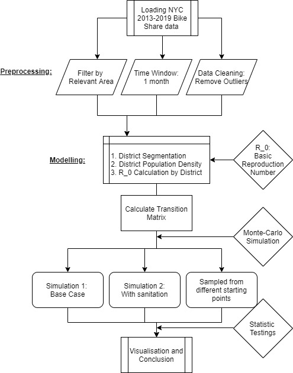

# Datathon Github:

## Data pipieline
In this repository, we have performed a data analysis on NYC Bike sharing data to project a disease propagation of COVID-19 through bike-sharing and proposed suggestions to the issues.

Our workflow follows the folowing guideline:  




## File descriptions
`Data Processing and EPA.ipynb`: pre-process the data, clean and remove outliers.

`Data_pipelin.ipynb`: The data processing pipeline to remove outlying stations and map coordinates.
`Map Binning.ipynb`: Where we perform map binning. 
`Transition Matrix.ipynb`: Ipynb where we perform transition matrix calculation.   
`Dynamics.ipynb`: IPynb to model the disease propagation dynamic.    
  

## File structure
```
/    : root directory with all the code snippets
Data/: Map binning and data key
Imgs/: Images from the analysis

```

